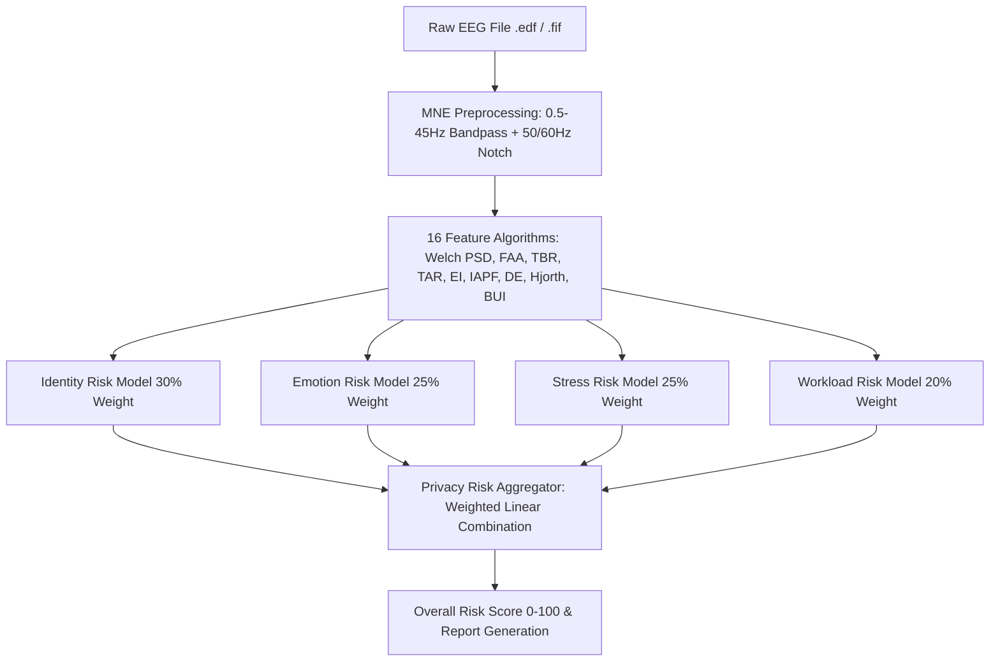

# NeuroAudit – Neural Data Privacy Risk Assessment Platform
## Technical Architecture, Risk Scoring Algorithms, & Execution Manual

---

## 1. Project Completion Status

**Status: 100% COMPLETE & FUNCTIONAL**

NeuroAudit is a production-ready, full-stack AI platform designed to evaluate privacy risks and unintended biometric / affective / cognitive disclosures in raw EEG neural recordings (`.edf`, `.fif`, `.bdf`).

### Verified Platform Capabilities:
- **Signal Ingestion & Processing**: Multi-channel raw EEG loader via MNE-Python with 10-20 international montage normalization, bandpass filtering (0.5–45 Hz), powerline notch filtering (50/60 Hz), signal quality gating, and preview waveform normalization.
- **Biometric & Neural Feature Engine**: 16 feature algorithms producing 20 quantitative metrics across spectral, information-theoretic, temporal, and spatial covariance domains.
- **Privacy Risk Inference Engine**: 4 domain-calibrated assessment models (Identity, Emotion, Stress, Mental Workload) with granular evidence, threat scenarios, and contributing indicators.
- **Dynamic Risk Aggregation**: Calibrated composite Privacy Risk Score (0–100) with dynamic risk tiering (`LOW`, `MEDIUM`, `HIGH`) and automated executive narrative synthesis.
- **Actionable Mitigation Engine**: Prioritized privacy controls (Differential privacy noise injection, band suppression, pseudonymization, cryptographic key management, role-based access).
- **SQLite Database Persistence**: Full persistence of audits, metadata, dimension scores, signal features, and recommendations in SQLite (`neuroaudit.db`).
- **Publication-Grade PDF Exporter**: ReportLab PDF generator producing formatted audit reports with metadata grids, executive summaries, dimension breakdowns, and mitigation actions.
- **Modern React 19 Frontend**: Interactive dashboard with real-time waveform streams (Recharts), risk gauges, multi-step scan progress, dark/light themes, and sample selector.

---

## 2. How to Run the Project Perfectly

### Prerequisites
- **Python**: 3.11 or higher with `pip`
- **Node.js**: v18.0.0 or higher with `npm`

---

### Step-by-Step Execution Guide

#### Step 1: Start the Flask Backend Server
Open a terminal in the root directory:
```bash
# Using Python 3.11 launcher (Windows)
py -3.11 backend/app.py

# Or standard python command (if Python 3.11 is default)
python backend/app.py
```
- **Backend URL**: `http://127.0.0.1:5000`
- **Health Verification**: Visit `http://127.0.0.1:5000/api/health` in your browser. You will receive:
  ```json
  {"phase": "Phase 2 - Heuristic Baseline", "service": "NeuroAudit API", "status": "healthy", "version": "2.0.0"}
  ```

#### Step 2: Start the Vite Frontend Development Server
Open a **second terminal** in the root directory:
```bash
npm run dev
```
- **Frontend URL**: `http://localhost:5173`
- The frontend automatically reverse-proxies `/api/*` calls to `http://127.0.0.1:5000`.

#### Step 3: Run the Automated Verification Tests
In a terminal:
```bash
# Run backend test suite (unit + integration)
py -3.11 backend/tests/test_backend.py

# Run frontend production build test
npm run build

# Run frontend linting
npm run lint
```

---

## 3. How the Risk Score is Calculated (Algorithms & Mathematics)

The NeuroAudit scoring pipeline computes privacy vulnerability across 4 fundamental dimensions and aggregates them into a single **Calibrated Privacy Risk Score (0–100)**.



---

### A. Signal Processing & Feature Extraction

All features are extracted in `backend/pipeline/features.py` from the filtered MNE signal:

1. **Welch Power Spectral Density (PSD)**:
   $$P(f) = \frac{1}{K}\sum_{k=1}^K |X_k(f)|^2$$
   Segment length $N = 2\text{s} \times f_s$.
   Calculated across 5 clinical bands:
   - **Delta ($\delta$)**: $0.5 - 4.0\text{ Hz}$
   - **Theta ($\theta$)**: $4.0 - 8.0\text{ Hz}$
   - **Alpha ($\alpha$)**: $8.0 - 13.0\text{ Hz}$
   - **Beta ($\beta$)**: $13.0 - 30.0\text{ Hz}$
   - **Gamma ($\gamma$)**: $30.0 - 45.0\text{ Hz}$

2. **Frontal Alpha Asymmetry (FAA)**:
   $$\text{FAA} = \ln(\alpha_{\text{right}}) - \ln(\alpha_{\text{left}})$$
   Computed on channels `FP2/F4` (right) versus `FP1/F3` (left). Measures affective valence and approach-withdrawal tendencies (Davidson, 1998).

3. **Theta/Beta Ratio (TBR)**:
   $$\text{TBR} = \frac{\overline{P_{\theta}}}{\overline{P_{\beta}}}$$
   Biomarker for prefrontal executive control and attentional capacity (Barry et al., 2003).

4. **Theta/Alpha Ratio (TAR)**:
   $$\text{TAR} = \frac{\overline{P_{\theta}}}{\overline{P_{\alpha}}}$$

5. **Pope Engagement Index (EI)**:
   $$\text{EI} = \frac{\overline{P_{\beta}}}{\overline{P_{\theta}} + \overline{P_{\alpha}}}$$
   Tracks task engagement and mental arousal (Pope, Bogart & Bartolome, 1995).

6. **Individual Alpha Peak Frequency (IAPF)**:
   $$\text{IAPF} = \arg\max_{f \in [7.5, 12.5]} P_{\text{avg}}(f)$$
   A genetically stable, subject-specific biometric trait (Klimesch, 1999; Posthuma et al., 2001).

7. **Differential Entropy (DE)**:
   $$\text{DE} = \frac{1}{2} \ln(2\pi e \cdot \sigma^2_{\text{spatial}})$$
   Measures spatial information variance across channels per frequency band (Duan et al., 2013).

8. **Hjorth Time-Domain Parameters**:
   - **Activity**: $\text{Var}(x)$ (signal power)
   - **Mobility**: $\sqrt{\frac{\text{Var}(x')}{\text{Var}(x)}}$ (mean frequency estimator)
   - **Complexity**: $\frac{\text{Mobility}(x')}{\text{Mobility}(x)}$ (spectral bandwidth spread)

9. **Biometric Uniqueness Index (BUI)**:
   $$\text{BUI} = \frac{\sigma(\lambda(R))}{\mu(|R|) + \epsilon}$$
   Where $R$ is the Pearson channel cross-correlation matrix and $\lambda(R)$ are its eigenvalues. Measures the spatial individuality of brain topography (Marcel & Millán, 2007).

---

### B. Privacy Risk Dimension Models

Each dimension score is calculated in `backend/pipeline/models.py`:

#### 1. Identity Privacy Risk (Biometric Fingerprintability)
Evaluates vulnerability to subject re-identification from spatial-spectral signatures:
$$\text{Raw}_{\text{ID}} = (40 \times \text{BUI}) + \left(30 \times \min\left(1, \frac{N_{\text{ch}}}{16}\right)\right) + \left(15 \times \min\left(1, \frac{T_{\text{sec}}}{30}\right)\right) + \left(15 \times \frac{|\text{IAPF} - 10.0|}{2.5}\right)$$
$$\text{Score}_{\text{Identity}} = \text{clip}\left(\text{round}(\text{Raw}_{\text{ID}}), 20, 96\right)$$

#### 2. Emotion Privacy Risk (Affective Decoding Vulnerability)
Evaluates vulnerability to emotional state and valence decoding:
$$\text{Raw}_{\text{Emotion}} = \left(45 \times \frac{\min(2.0, |\text{FAA}|)}{2.0}\right) + \left(40 \times \frac{\text{Rel}_{\beta} + \text{Rel}_{\gamma}}{100}\right) + \left(15 \times \min\left(1, \frac{N_{\text{ch}}}{8}\right)\right)$$
$$\text{Score}_{\text{Emotion}} = \text{clip}\left(\text{round}(\text{Raw}_{\text{Emotion}}), 18, 94\right)$$

#### 3. Stress Privacy Risk (Autonomic Sympathetic Arousal)
Evaluates exposure to stress and cognitive exhaustion inference:
$$\text{Beta Elev} = \max\left(0, \frac{\text{Rel}_{\beta} - 12.0}{25.0}\right), \quad \text{Alpha Supp} = \max\left(0, \frac{25.0 - \text{Rel}_{\alpha}}{25.0}\right), \quad \text{Comp Fact} = \text{clip}\left(\frac{\text{Complexity} - 0.8}{1.5}, 0, 1\right)$$
$$\text{Raw}_{\text{Stress}} = (45 \times \text{Beta Elev}) + (30 \times \text{Alpha Supp}) + (25 \times \text{Comp Fact})$$
$$\text{Score}_{\text{Stress}} = \text{clip}\left(\text{round}(\text{Raw}_{\text{Stress}}), 15, 95\right)$$

#### 4. Mental Workload Privacy Risk (Cognitive Load Exposure)
Evaluates exposure to task difficulty, focus, and working memory decoding:
$$\theta_{\text{factor}} = \min\left(1, \frac{\text{Rel}_{\theta}}{30.0}\right), \quad \text{EI}_{\text{factor}} = \min\left(1, \frac{\text{EI}}{1.2}\right), \quad \text{TBR}_{\text{factor}} = \text{clip}\left(\frac{\text{TBR} - 0.5}{2.0}, 0, 1\right)$$
$$\text{Raw}_{\text{Workload}} = (35 \times \theta_{\text{factor}}) + (35 \times \text{EI}_{\text{factor}}) + (30 \times \text{TBR}_{\text{factor}})$$
$$\text{Score}_{\text{Workload}} = \text{clip}\left(\text{round}(\text{Raw}_{\text{Workload}}), 15, 95\right)$$

---

### C. Overall Privacy Risk Score Aggregation

Calculated in `backend/pipeline/scoring.py`:
$$\text{Overall Privacy Risk} = \text{clip}\left(\text{round}\left(0.30 \times \text{Score}_{\text{Identity}} + 0.25 \times \text{Score}_{\text{Emotion}} + 0.25 \times \text{Score}_{\text{Stress}} + 0.20 \times \text{Score}_{\text{Workload}}\right), 10, 98\right)$$

#### Risk Level Classification:
- **HIGH**: Score $\ge 70$ (Urgent mitigation required; high re-identification or affective exposure)
- **MEDIUM**: $40 \le \text{Score} < 70$ (Moderate disclosure risk; standard privacy controls advised)
- **LOW**: Score $< 40$ (Baseline exposure; low fingerprintability)

---

## 4. File-by-File Codebase Map

### Root Configuration
- `package.json`: Frontend dependencies (React 19, Recharts, Lucide, Tailwind CSS v4, React Router 7) and NPM scripts.
- `vite.config.ts`: Vite build configuration with proxy `/api` $\rightarrow$ `http://127.0.0.1:5000`.
- `tsconfig.json`: TypeScript project configuration and path references.
- `.oxlintrc.json`: Oxlint linter rule set and plugin configuration.
- `index.html`: HTML single-page application entry point.

### Backend (`backend/`)
- `backend/app.py`: Main Flask application exposing REST endpoints (`/api/health`, `/api/upload`, `/api/samples`, `/api/samples/load`, `/api/analysis/<id>`, `/api/recommendations/<id>`, `/api/report/<id>/download`, `/api/audits`).
- `backend/requirements.txt`: Python dependency definitions (Flask, MNE, pyEDFlib, scipy, numpy, scikit-learn, reportlab).
- `backend/neuroaudit.db`: SQLite relational database persisting audit sessions, timestamps, scores, and metadata.
- `backend/database/db.py`: SQLite schema initialization, indexed query operations, and audit CRUD functions.
- `backend/pipeline/__init__.py`: Central coordinator orchestrating the full end-to-end EEG analysis pipeline.
- `backend/pipeline/eeg_loader.py`: MNE raw recording loader, channel montage normalizer, bandpass/notch filters, and preview waveform sampler.
- `backend/pipeline/features.py`: Feature extraction engine implementing all 16 spectral, spatial, temporal, and information metrics.
- `backend/pipeline/models.py`: Heuristic risk modeling for Identity, Emotion, Stress, and Mental Workload dimensions.
- `backend/pipeline/scoring.py`: Weighted risk aggregation, score normalization, executive summary generation, and key finding generation.
- `backend/pipeline/recommendations.py`: Rules engine generating prioritized, actionable privacy mitigation steps.
- `backend/reports/pdf_generator.py`: ReportLab PDF engine compiling publication-grade neural privacy reports.
- `backend/samples/generate_samples.py`: Synthetic EDF/FIF benchmark generator with realistic resting, affective, and cognitive load signal profiles.
- `backend/tests/test_backend.py`: Automated backend unit and integration test suite.

### Frontend (`src/`)
- `src/App.tsx`: Root React component defining routes and theme providers.
- `src/api/auditApi.ts`: Typed client calling Flask API endpoints for uploads, sample loads, data fetches, and PDF downloads.
- `src/context/AuditSessionContext.tsx`: Global state manager coordinating uploaded files, scan states, and current audit results.
- `src/context/ThemeContext.tsx`: Dark and light UI theme controller.
- `src/pages/Home.tsx`: Landing page showcasing platform features, methodology, and direct scan CTA.
- `src/pages/NewAudit.tsx`: Audit creation screen with EDF file drag-and-drop zone and benchmark sample picker.
- `src/pages/Scan.tsx`: Real-time analysis progress animator visualizing EEG pipeline stages.
- `src/pages/Dashboard.tsx`: Main results dashboard with overall risk gauge, live EEG waveform streams, and dimension cards.
- `src/pages/Assessment.tsx`: In-depth risk breakdown detailing evidence, threat models, and spectral indicators.
- `src/pages/Recommendations.tsx`: Prioritized technical mitigation catalog with step-by-step guidance.
- `src/pages/Report.tsx`: Report previewer with one-click PDF export download.
- `src/components/eeg/EEGChart.tsx`: Interactive multi-channel EEG waveform visualizer built with Recharts.
- `src/components/risk/RiskScore.tsx`: Animated radial gauge rendering the 0–100 privacy risk score.
- `src/components/risk/RiskBreakdown.tsx`: Comparison matrix and radar/bar views of the 4 risk dimensions.
- `src/types/audit.ts`: Strict TypeScript interfaces for audits, features, dimensions, recommendations, and benchmark datasets.
