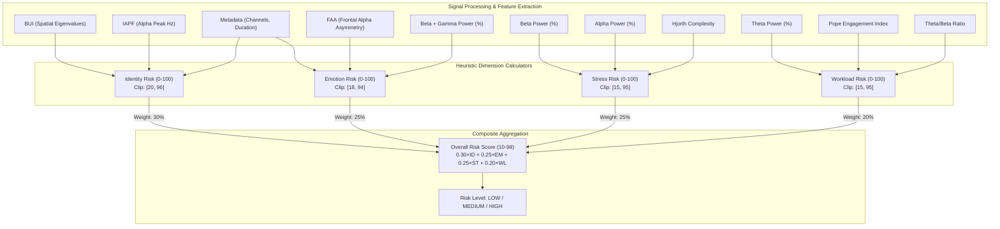

# NeuroAudit — Baseline Heuristic Privacy Risk Methodology

**Document Version:** 1.0.0 (Phase 3)  
**Date:** August 2026  
**Status:** Validated Baseline Methodology Specification  
**Implementation Modules:**  
- [`backend/pipeline/models.py`](file:///c:/Users/DINESH/Downloads/neuro/backend/pipeline/models.py) (Dimension risk baseline calculators)  
- [`backend/pipeline/scoring.py`](file:///c:/Users/DINESH/Downloads/neuro/backend/pipeline/scoring.py) (Composite risk aggregator)  

---

## 1. Executive Summary & Model Classification

The NeuroAudit risk calculation system is classified strictly as a **Baseline Heuristic Privacy Risk Model**.

> [!IMPORTANT]
> **Definitive Scope Statement:**
> All privacy risk scores produced by this baseline are **heuristic estimates of potential privacy exposure**, indicating relative susceptibility to automated inference based on published neuroscience literature. They are **NOT** empirical probabilities of data disclosure, nor do they represent clinical, neurological, or psychiatric diagnoses.

### Pipeline Flow Architecture
$$\text{Raw Preprocessed EEG} \longrightarrow \text{Extracted Features} \longrightarrow \text{Feature Transformation} \longrightarrow \text{Dimension Scores (0–100)} \longrightarrow \text{Overall Risk Score (10–98)}$$



---

## 2. Dimension Formulations & Detailed Audit

### 2.1 Dimension 1: Identity Privacy Risk (Biometric Fingerprintability)

#### Input Features
* `biometric_uniqueness_index` ($\text{BUI} \ge 0.0$)
* `channel_count` ($N_{ch} \ge 1$)
* `duration_sec` ($T_{sec} > 0.0$)
* `iapf_hz` ($\text{IAPF} \in [7.5, 12.5]\text{ Hz}$)

#### Mathematical Transformations & Formula
$$\text{ch\_factor} = \min\left(1.0, \frac{N_{ch}}{16.0}\right)$$
$$\text{dur\_factor} = \min\left(1.0, \frac{T_{sec}}{30.0}\right)$$
$$\text{iapf\_dist} = \frac{|\text{IAPF} - 10.0|}{2.5}$$
$$\text{id\_base} = (\text{BUI} \times 40.0) + (\text{ch\_factor} \times 30.0) + (\text{dur\_factor} \times 15.0) + (\text{iapf\_dist} \times 15.0)$$
$$\text{Identity Score} = \text{clip}\left(\text{round}(\text{id\_base}), 20, 96\right)$$

#### Interpretation
Estimates potential vulnerability of neural data to subject re-identification based on individual frequency traits (IAPF) and spatial channel correlation non-uniformity (BUI).

#### Assumptions & Limitations
* Assumes higher channel counts ($\ge 16$) and longer durations ($\ge 30\text{s}$) provide saturated biometric identification utility.
* Assumes 10.0 Hz represents the universal population baseline for IAPF.
* BUI is an empirical proxy for cross-channel covariance dispersion; it does not prove identity.

---

### 2.2 Dimension 2: Emotion Privacy Risk (Affective Decoding Vulnerability)

#### Input Features
* `frontal_alpha_asymmetry` ($\text{FAA} \in [-\infty, +\infty]$)
* `rel_beta` ($P_{\beta} \in [0, 100]\%$)
* `rel_gamma` ($P_{\gamma} \in [0, 100]\%$)
* `channel_count` ($N_{ch} \ge 1$)

#### Mathematical Transformations & Formula
$$\text{faa\_mag} = \min(2.0, |\text{FAA}|)$$
$$\text{beta\_gamma\_rel\_power} = \frac{P_{\beta} + P_{\gamma}}{100.0}$$
$$\text{ch\_spatial\_factor} = \min\left(1.0, \frac{N_{ch}}{8.0}\right)$$
$$\text{emotion\_base} = \left(\frac{\text{faa\_mag}}{2.0} \times 45.0\right) + (\text{beta\_gamma\_rel\_power} \times 40.0) + (\text{ch\_spatial\_factor} \times 15.0)$$
$$\text{Emotion Score} = \text{clip}\left(\text{round}(\text{emotion\_base}), 18, 94\right)$$

#### Interpretation
Estimates potential susceptibility to affective valence decoding (via frontal alpha asymmetry magnitude) and autonomic arousal inference (via high-frequency beta/gamma relative power).

#### Assumptions & Limitations
* Treats asymmetry magnitude $|\text{FAA}|$ symmetrically without distinguishing between positive (approach) and negative (withdrawal) valence directions.
* Uses sum of relative powers ($P_\beta + P_\gamma$), which can be elevated by muscle/EMG artifacts.

---

### 2.3 Dimension 3: Stress Privacy Risk (Autonomic & Mental Stress Exposure)

#### Input Features
* `rel_beta` ($P_{\beta} \in [0, 100]\%$)
* `rel_alpha` ($P_{\alpha} \in [0, 100]\%$)
* `hjorth_complexity` ($\text{Complexity} \ge 0.0$)

#### Mathematical Transformations & Formula
$$\text{beta\_elevation} = \max\left(0.0, \frac{P_{\beta} - 12.0}{25.0}\right)$$
$$\text{alpha\_suppression} = \max\left(0.0, \frac{25.0 - P_{\alpha}}{25.0}\right)$$
$$\text{complexity\_factor} = \min\left(1.0, \max\left(0.0, \frac{\text{Complexity} - 0.8}{1.5}\right)\right)$$
$$\text{stress\_base} = (\text{beta\_elevation} \times 45.0) + (\text{alpha\_suppression} \times 30.0) + (\text{complexity\_factor} \times 25.0)$$
$$\text{Stress Score} = \text{clip}\left(\text{round}(\text{stress\_base}), 15, 95\right)$$

#### Interpretation
Estimates exposure to stress/arousal inference based on spectral shift patterns (beta elevation, alpha desynchronization/suppression) and signal non-linear irregularities (Hjorth complexity).

#### Assumptions & Limitations
* Assumes static baseline constants: $12\%$ for beta and $25\%$ for alpha, which vary significantly across individual resting baselines and recording montages.
* Does not account for task context or circadian factors.

---

### 2.4 Dimension 4: Mental Workload Privacy Risk (Cognitive Load Exposure)

#### Input Features
* `rel_theta` ($P_{\theta} \in [0, 100]\%$)
* `engagement_index` ($\text{EI} = \frac{P_{\beta}}{P_{\theta} + P_{\alpha}}$)
* `theta_beta_ratio` ($\text{TBR} = \frac{P_{\theta}}{P_{\beta}}$)

#### Mathematical Transformations & Formula
$$\text{theta\_elevation} = \min\left(1.0, \frac{P_{\theta}}{30.0}\right)$$
$$\text{engagement\_factor} = \min\left(1.0, \frac{\text{EI}}{1.2}\right)$$
$$\text{tbr\_factor} = \min\left(1.0, \max\left(0.0, \frac{\text{TBR} - 0.5}{2.0}\right)\right)$$
$$\text{workload\_base} = (\text{theta\_elevation} \times 35.0) + (\text{engagement\_factor} \times 35.0) + (\text{tbr\_factor} \times 30.0)$$
$$\text{Mental Workload Score} = \text{clip}\left(\text{round}(\text{workload\_base}), 15, 95\right)$$

#### Interpretation
Estimates vulnerability to cognitive workload and mental task demand profiling via frontal midline theta elevation, Pope task engagement index, and theta/beta ratio.

#### Assumptions & Limitations
* Saturation constants ($30\%$ theta, $1.2$ engagement index, $2.5$ TBR upper range) are heuristic selections.
* Global channel averaging smooths out localized frontal-midline theta changes.

---

## 3. Overall Composite Risk Aggregation

The composite Privacy Risk Score aggregates the 4 dimension scores through a weighted linear combination verified in [`backend/pipeline/scoring.py`](file:///c:/Users/DINESH/Downloads/neuro/backend/pipeline/scoring.py):

$$\text{Overall Risk} = \text{round}\left(0.30 \times S_{\text{Identity}} + 0.25 \times S_{\text{Emotion}} + 0.25 \times S_{\text{Stress}} + 0.20 \times S_{\text{Workload}}\right)$$
$$\text{Overall Risk}_{\text{final}} = \max(10, \min(98, \text{Overall Risk}))$$

### Risk Level Categorization
* **HIGH Risk:** $\text{Overall Risk} \ge 70$
* **MEDIUM Risk:** $40 \le \text{Overall Risk} < 70$
* **LOW Risk:** $\text{Overall Risk} < 40$

---

## 4. Assumption Classification Taxonomy

Every component in the baseline model has been audited and classified into four academic categories:

| Component / Formula Element | Classification | Rationale & Justification |
|---|:---:|---|
| **IAPF as Biometric Marker** | **A. Evidence-Supported** | Supported by extensive literature (Klimesch 1999, Posthuma et al. 2001) demonstrating intra-subject stability and inter-subject variance. |
| **FAA for Affective State** | **A. Evidence-Supported** | Davidson approach-withdrawal affective model (Davidson 1998, 2004; Harmon-Jones & Allen 1998). |
| **Theta Elevation for Workload** | **A. Evidence-Supported** | Frontal midline theta correlates with working memory and mental demand (Gevins et al. 1997, Onton et al. 2005). |
| **Beta Elevation & Alpha Suppression for Stress** | **A. Evidence-Supported** | Classic sympathetic arousal markers (Aftanas & Golocheikine 2001, Seo & Lee 2010). |
| **Channel Count Scaling ($\min(1.0, N/16)$)** | **B. Engineering Assumption** | Scalp spatial sampling above 16 channels yields diminishing returns for basic spectral topologies in heuristic models. |
| **Recording Duration Factor ($\min(1.0, T/30)$)** | **B. Engineering Assumption** | 30-second window length assumed sufficient for stationary resting-state spectral stability. |
| **Linear Combination Weights [30%, 25%, 25%, 20%]** | **C. Arbitrary / Manual Choice** | Assigned to prioritize identity re-identification over transient state inference; not fitted to empirical risk utility functions. |
| **Fixed Baselines (12% Beta, 25% Alpha, 10 Hz IAPF)** | **C. Arbitrary / Manual Choice** | Universal population constants chosen to anchor heuristic scaling without individual calibration. |
| **Clipping Bounds ([20, 96], [18, 94], [15, 95], [10, 98])** | **C. Arbitrary / Manual Choice** | Designed to prevent 0% or 100% certainty claims in heuristic scoring. |
| **BUI Correlation Matrix Eigenvalue Spread** | **D. Needs Empirical Validation** | Proposed heuristic proxy for spatial distinctiveness; needs empirical cross-dataset re-identification validation. |
| **Mapping Heuristic Scores to Attack Disclosure Probability** | **D. Needs Empirical Validation** | The link between a heuristic score of 75/100 and actual machine-learning reconstruction accuracy requires empirical calibration. |

---

## 5. Traceable Score Contribution Breakdown

To ensure full transparency and auditability, each dimension dictionary exposes structured `contributors`:

```json
{
  "key": "identity",
  "label": "Identity",
  "score": 68,
  "level": "MEDIUM",
  "contributors": [
    {
      "feature": "Biometric Uniqueness Index (BUI)",
      "raw_value": 0.8124,
      "normalized_value": 0.8124,
      "weight": 0.40,
      "contribution": 32.50
    },
    {
      "feature": "Channel Count Factor",
      "raw_value": 8,
      "normalized_value": 0.5000,
      "weight": 0.30,
      "contribution": 15.00
    },
    {
      "feature": "Recording Duration Factor",
      "raw_value": 60.0,
      "normalized_value": 1.0000,
      "weight": 0.15,
      "contribution": 15.00
    },
    {
      "feature": "IAPF Deviation from 10Hz",
      "raw_value": 9.50,
      "normalized_value": 0.2000,
      "weight": 0.15,
      "contribution": 3.00
    }
  ]
}
```
*(Base Sum = $32.50 + 15.00 + 15.00 + 3.00 = 65.50 \to \text{round}(65.50) = 66 \to \text{clipped to } [20, 96] = 66$).*
