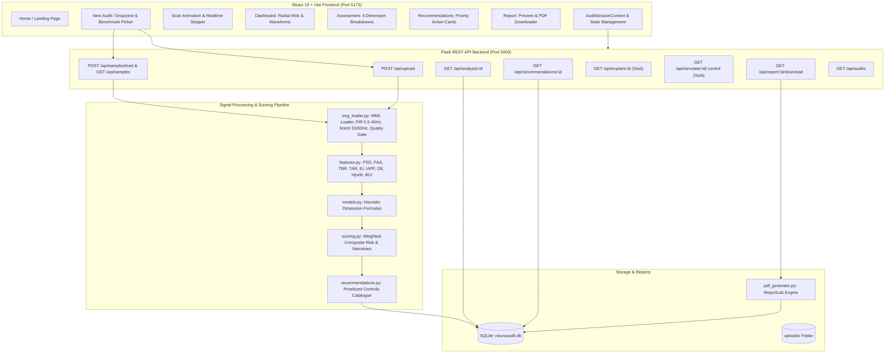

# NeuroAudit – Comprehensive System Audit (Phase 0)

**Document Version:** 1.0.0  
**Date:** August 2026  
**Auditor Role:** Senior Software Engineer, EEG Signal-Processing Engineer, ML Engineer & Cybersecurity Researcher  
**Target Repository:** `NeuroAudit` (`https://github.com/Deepika-B-17/EEG-1.git`)  
**Platform Classification:** Research Prototype for Neural Data Privacy Risk Assessment  

---

## 1. Executive Summary & Audit Overview

NeuroAudit is an EEG neural-data privacy risk assessment platform designed to analyze electroencephalogram (EEG) recordings and estimate potential sensitive information disclosure risks across four core dimensions:
1. **Identity / Biometric Re-Identification Risk**
2. **Emotion / Affective State Inference Risk**
3. **Stress / Sympathetic Arousal Inference Risk**
4. **Mental Workload / Cognitive Load Inference Risk**

The existing repository is a functioning, full-stack application comprising:
- A modern **React 19 + TypeScript + Vite + Tailwind CSS v4** frontend.
- A **Python 3.11 + Flask + Flask-CORS** REST API backend.
- Signal processing and feature extraction utilizing **MNE-Python, SciPy, and NumPy**.
- A relational persistence layer using **SQLite (`neuroaudit.db`)**.
- A publication-grade PDF report generator using **ReportLab**.
- Synthetic benchmark generators producing standard `.edf` files using **PyEDFlib**.

### Current State vs. Target State
- **Current State:** The platform is entirely driven by **heuristic baseline formulas** derived from neuroscience literature (band powers, FAA, TBR, IAPF, BUI, Hjorth complexity). It contains no trained machine learning models, no empirical dataset cross-validation, and no empirical calibration curve mapping model accuracy to risk exposure.
- **Target Research State:** A dual-layer architecture preserving the transparent **Heuristic Baseline** while integrating an **Empirical ML Inference Layer** (scikit-learn models: Logistic Regression, Random Forest, SVM) evaluated using rigorous, subject-aware group cross-validation (preventing subject leakage), an empirical calibration layer, evidence-based recommendations, and defense simulations.

---

## 2. Current System Architecture



---

## 3. Existing Features & Capabilities

### A. Signal Processing & Feature Extraction Inventory (`backend/pipeline/features.py`)
The pipeline processes filtered MNE raw objects and calculates 16 algorithms yielding 20 distinct metrics:

| # | Feature Name | Mathematical / Algorithmic Basis | Target Neuro-Privacy Dimension |
|---|---|---|---|
| 1–5 | Absolute Band Powers ($\delta, \theta, \alpha, \beta, \gamma$) | Welch Periodogram ($N=2\text{s} \times f_s$) with trapezoidal integration | All Dimensions (Spectral composition) |
| 6 | Relative Band Powers ($\%$) | $\text{Power}_{\text{band}} / \sum \text{Power} \times 100$ | Stress, Workload, Emotion |
| 7 | Power Spectral Density (PSD) | $\frac{1}{K}\sum |X_k(f)|^2$ across frequencies | Base representation for spectral metrics |
| 8 | Frontal Alpha Asymmetry (FAA) | $\ln(\alpha_{\text{right}}) - \ln(\alpha_{\text{left}})$ (FP2/F4 vs FP1/F3) | Emotion (Affective Valence) |
| 9 | Theta/Beta Ratio (TBR) | $\overline{P_\theta} / \overline{P_\beta}$ | Mental Workload / Executive Control |
| 10 | Theta/Alpha Ratio (TAR) | $\overline{P_\theta} / \overline{P_\alpha}$ | Drowsiness / Workload baseline |
| 11 | Pope Engagement Index (EI) | $\overline{P_\beta} / (\overline{P_\theta} + \overline{P_\alpha})$ | Mental Workload & Task Engagement |
| 12 | Individual Alpha Peak Frequency (IAPF) | $\arg\max_{f \in [7.5, 12.5]} P(f)$ | Identity / Biometric Marker |
| 13 | Differential Entropy (DE) | $0.5 \ln(2\pi e \cdot \text{Var}_{\text{spatial}}(P_{\text{band}}))$ | Emotion & Spatial Information Spread |
| 14 | Hjorth Activity | $\text{Var}(x(t))$ | Signal Power / Amplitude |
| 15 | Hjorth Mobility | $\sqrt{\text{Var}(x'(t)) / \text{Var}(x(t))}$ | Mean Frequency Estimator |
| 16 | Hjorth Complexity | $\text{Mobility}(x'(t)) / \text{Mobility}(x(t))$ | Signal Irregularity / Stress Arousal |
| – | Biometric Uniqueness Index (BUI) | $\sigma(\lambda(R)) / (\mu(|R|) + \epsilon)$ ($R=$ correlation matrix) | Identity / Spatial Cross-correlation |

### B. Preprocessing & Quality Gating (`backend/pipeline/eeg_loader.py`)
- Standard channel renaming to 10-20 international nomenclature (`sanitize_channel_name`).
- Bandpass filtering (0.5–45.0 Hz FIR, `firwin`).
- Notch filtering (50.0 Hz & 60.0 Hz).
- Heuristic quality checks (`check_eeg_quality`): duration check ($\ge 2\text{s}$), sampling frequency check ($\ge 64\text{ Hz}$), minimum channels ($\ge 1$, recommended $\ge 4$), flatline detection ($\text{std} < 1\text{ nV}$), clipping check ($> 500\text{ }\mu\text{V}$), and NaN/Inf count.
- Downsampled preview trace extraction (200 points per channel, normalized with $\mu=0, 3\sigma$ clipping to $[-1.5, 1.5]$).

---

## 4. Existing APIs & Endpoints

| Method | Endpoint | Description | Status / Notes |
|---|---|---|---|
| `GET` | `/` | API discovery and endpoint index | Functional |
| `GET` | `/api/health` | Health & status check (`version: 2.0.0`) | Functional |
| `POST` | `/api/upload` | Upload `.edf`, `.fif`, `.bdf`, `.set` file, run pipeline, save audit | Functional; 50MB max, secure_filename |
| `GET` | `/api/analysis/<session_id>` | Fetch complete analysis record, features, preview traces, dimensions | Functional |
| `GET` | `/api/recommendations/<session_id>` | Fetch structured prioritized recommendations | Functional |
| `GET` | `/api/explain/<session_id>` | Fetch per-dimension explainability blocks and quality report | Functional on backend; not yet called in frontend UI |
| `GET` | `/api/simulate/<session_id>/<control_id>` | Fetch simulated risk delta for a control | Backend stub (`REQUIRES_EMPIRICAL_VALIDATION`) |
| `GET` | `/api/report/<session_id>/download` | Generate and download publication-grade PDF report | Functional |
| `GET` | `/api/audits` | Fetch list of recent audits from SQLite | Functional |
| `GET` | `/api/samples` | List benchmark EEG datasets | Functional |
| `POST` | `/api/samples/load` | Load synthetic benchmark EEG and run pipeline | Functional |

---

## 5. Existing Database Schema (`backend/database/db.py`)

The SQLite database (`backend/neuroaudit.db`) manages a single indexed table:

```sql
CREATE TABLE IF NOT EXISTS audits (
    id INTEGER PRIMARY KEY AUTOINCREMENT,
    session_id TEXT UNIQUE NOT NULL,
    audit_name TEXT NOT NULL,
    file_name TEXT NOT NULL,
    file_path TEXT,
    file_size INTEGER DEFAULT 0,
    description TEXT DEFAULT '',
    overall_risk INTEGER NOT NULL,
    risk_level TEXT NOT NULL,
    overall_summary TEXT NOT NULL,
    executive_summary TEXT NOT NULL,
    key_findings TEXT NOT NULL,         -- JSON Array
    dimensions TEXT NOT NULL,           -- JSON Array of dimension objects
    features TEXT DEFAULT '{}',         -- JSON Object with traces & metadata
    recommendations TEXT NOT NULL,      -- JSON Array of recommendation objects
    quality_report TEXT DEFAULT '{}',   -- JSON Object of quality gate metrics
    status TEXT DEFAULT 'Complete',
    created_at TIMESTAMP DEFAULT CURRENT_TIMESTAMP
);
CREATE INDEX IF NOT EXISTS idx_audits_session_id ON audits(session_id);
CREATE INDEX IF NOT EXISTS idx_audits_created_at ON audits(created_at DESC);
```

---

## 6. Existing ML / AI Components

- **Current AI/ML Status:** The system **does not currently contain trained ML classifiers**.
- All risk scores are produced by deterministic heuristic formulas in `backend/pipeline/models.py`.
- No supervised learning models (Logistic Regression, Random Forest, SVM) are currently active in the core pipeline.
- No model registry, cross-validation harness, or dataset builder currently exists.

---

## 7. Existing Scoring Methodology & Heuristics

All four dimension scores are computed on a normalized $[0, 100]$ scale:

1. **Identity Risk Formula:**
   $$\text{Score}_{\text{Identity}} = \text{clip}\left(\text{round}\left(40 \cdot \text{BUI} + 30 \cdot \min\left(1, \frac{N_{\text{ch}}}{16}\right) + 15 \cdot \min\left(1, \frac{T_{\text{sec}}}{30}\right) + 15 \cdot \frac{|\text{IAPF} - 10.0|}{2.5}\right), 20, 96\right)$$

2. **Emotion Risk Formula:**
   $$\text{Score}_{\text{Emotion}} = \text{clip}\left(\text{round}\left(45 \cdot \frac{\min(2.0, |\text{FAA}|)}{2.0} + 40 \cdot \frac{\text{Rel}_{\beta} + \text{Rel}_{\gamma}}{100} + 15 \cdot \min\left(1, \frac{N_{\text{ch}}}{8}\right)\right), 18, 94\right)$$

3. **Stress Risk Formula:**
   $$\text{Score}_{\text{Stress}} = \text{clip}\left(\text{round}\left(45 \cdot \max\left(0, \frac{\text{Rel}_{\beta}-12}{25}\right) + 30 \cdot \max\left(0, \frac{25-\text{Rel}_{\alpha}}{25}\right) + 25 \cdot \text{clip}\left(\frac{\text{Comp}-0.8}{1.5}, 0, 1\right)\right), 15, 95\right)$$

4. **Mental Workload Risk Formula:**
   $$\text{Score}_{\text{Workload}} = \text{clip}\left(\text{round}\left(35 \cdot \min\left(1, \frac{\text{Rel}_{\theta}}{30}\right) + 35 \cdot \min\left(1, \frac{\text{EI}}{1.2}\right) + 30 \cdot \text{clip}\left(\frac{\text{TBR}-0.5}{2.0}, 0, 1\right)\right), 15, 95\right)$$

5. **Overall Aggregated Privacy Risk:**
   $$\text{Overall Risk} = \text{clip}\left(\text{round}\left(0.30 \cdot \text{Score}_{\text{Identity}} + 0.25 \cdot \text{Score}_{\text{Emotion}} + 0.25 \cdot \text{Score}_{\text{Stress}} + 0.20 \cdot \text{Score}_{\text{Workload}}\right), 10, 98\right)$$

- **Risk Levels:** `HIGH` ($\ge 70$), `MEDIUM` ($40 \le \text{Score} < 70$), `LOW` ($< 40$).

---

## 8. Existing Recommendations Engine

- Structured catalogue in `backend/pipeline/recommendations.py`.
- Generates prioritized controls across `IDENTITY`, `EMOTION`, `STRESS`, `WORKLOAD`, and `GLOBAL` scopes.
- Computes priority (`CRITICAL`, `HIGH`, `MEDIUM`, `LOW`) using composite weighting: $\text{Sensitivity} \times \text{Severity} \times (1 + \text{Exposure})$.
- Controls include: Raw EEG RBAC, At-Rest/In-Transit Encryption, Participant Pseudonymization, Channel Minimization, Biometric Re-ID Testing, Purpose Limitation, and Federated Learning.

---

## 9. Existing Tests & Verification Suite

- `backend/tests/test_backend.py`:
  * `test_synthetic_eeg_and_features`: Generates synthetic signal, writes temp `.edf`, loads file, extracts features, tests models, tests scoring, tests recommendations, generates PDF.
  * `test_api_health`: Verifies `/api/health`.
  * `test_api_samples_and_load`: Tests sample loading, `/api/analysis/<id>`, and PDF downloading.
- `backend/tests/verify_live_api.py`: Standalone script for live server verification.
- `npm run build`: Validates TypeScript compilation and Vite bundling.
- **Coverage Gap:** No unit tests currently exist for invalid file uploads, malformed EDFs, missing channels, flatline signals, NaN inputs, or ML components.

---

## 10. Known Bugs & Fragile Assumptions

1. **Frontend-Backend Contract Discrepancy:**
   - Backend `recommendations.py` provides rich metadata (`threat`, `evidence`, `implementation`, `expected_impact`, `residual_risk`), but `src/types/audit.ts` and `src/components/recommendations/RecommendationCard.tsx` only render `why` and `action`.
   - Backend provides `/api/explain/<id>` and `qualityReport`, but the frontend has no dedicated Quality Card or Explainability Modal.
2. **Channel Name & Montage Mismatch in Frontend Charts:**
   - In `src/pages/Assessment.tsx`, `channelSets` hardcodes `['FP1', 'FP2', 'O1', 'O2']` for identity. If an uploaded EEG does not contain occipital channels (`O1`, `O2`), the `EEGChart` falls back to synthetic mock series for those specific missing channels rather than dynamically adapting to available channels.
3. **Filter Length Calculation Underflow:**
   - In `backend/pipeline/eeg_loader.py`, line 240: `filt_len = f"{max(0.5, duration_sec - 0.2):.1f}s"`. For signals shorter than 0.7s, this calculation may exceed `duration_sec`, causing MNE FIR filtering to fail.
4. **Temporary File Accumulation:**
   - Files uploaded to `backend/uploads/` are persisted with UUID prefixes but never cleaned up or purged, creating a disk exhaustion risk.
5. **EDF Channel Renaming Collision Risk:**
   - Channel renaming in `eeg_loader.py` handles basic cleanups but may collide if multiple channels simplify to the same standard 10-20 label.

---

## 11. Research & Epistemological Limitations

1. **Heuristic vs. Empirical Disclosure:**
   - Current risk numbers represent **heuristic candidate vulnerability indicators**, not empirical re-identification rates or classification accuracy.
2. **Differential Entropy (DE) Implementation Scope:**
   - `features.py` computes DE over the *spatial variance* of band power across channels rather than temporal sub-epoch variance. This is mathematically sound as a spatial metric but differs from standard temporal DE (e.g. SEED dataset conventions).
3. **Absence of Calibrated Attack Simulation:**
   - The platform asserts privacy risks without running an empirical adversary model (e.g. a k-NN / Random Forest re-identification probe).
4. **Epistemic Labeling:**
   - Must avoid clinical claims ("User is stressed") and maintain conservative, defensible privacy assertions ("Features associated with stress inference were detected").

---

## 12. Security Limitations

1. **Unrestricted CORS:** `CORS(app, resources={r"/api/*": {"origins": "*"}})` is open to all origins.
2. **Path Traversal Prevention:** Uses `werkzeug.utils.secure_filename`, which is good, but does not verify file magic numbers/headers before disk write.
3. **Error Leakage:** Raw backend tracebacks and file paths are potentially returned in 500 error JSON strings.
4. **Raw Signal Exposure:** Signal arrays are transmitted in API JSON without downsampling bounds or redaction if exported unsafely.

---

## 13. Recommended Improvement Order & Roadmap

1. **Phase 1: Stabilization & Hardening** – Resolve filter bounds, dynamic channel rendering in UI, upload cleanup, and comprehensive error handling.
2. **Phase 2: EEG Quality Assessment Module** – Implement `backend/pipeline/eeg_quality.py` with 0–100 prototype quality scoring and surface it in the UI.
3. **Phase 3: Feature Documentation & Validation** – Create `docs/FEATURE_DEFINITIONS.md`, sanitize mathematical ranges, and add numerical stability unit tests.
4. **Phase 4: Baseline Scoring Formalization** – Formalize `backend/pipeline/baseline_scoring.py`, isolate baseline heuristics from empirical models, and produce explicit contributor attribution.
5. **Phase 5: Research ML Module (Scikit-Learn)** – Build `backend/ml/` with dataset adapter, GroupKFold subject-aware validation, Logistic Regression, Random Forest, and Linear SVM models.
6. **Phase 6: Data Leakage Prevention** – Implement strict subject-isolated group splitting in evaluation harnesses.
7. **Phase 7: Empirical Privacy Inference & Calibration** – Wire empirical classifier metrics to the privacy exposure layer with transparent calibration curves.
8. **Phase 8: Explainability & Recommendations UI** – Expose deep explainability and evidence-driven recommendation cards in React.
9. **Phase 9: PDF Report Enhancement** – Update ReportLab generator to include quality metrics, empirical ML tables, and multi-page layout stability.
10. **Phase 10: Research Documentation & Reproducibility** – Publish comprehensive methodology documents and reproducible execution instructions.

---

## 14. Improvement Classification Matrix

### [MUST HAVE] – Critical for Reliability, Correctness & Research Integrity
- [x] **Preserve working full-stack pipeline** (Upload $\rightarrow$ Preprocessing $\rightarrow$ Features $\rightarrow$ Baseline Scoring $\rightarrow$ DB $\rightarrow$ UI $\rightarrow$ PDF).
- [ ] **Fix filter length underflow & short recording crash in EEG loader**.
- [ ] **Dynamic channel resolution in frontend EEGChart** (no fallback to mock data when real channels are present).
- [ ] **EEG Quality Assessment Module** (`backend/pipeline/eeg_quality.py`) returning `quality_score`, `quality_level`, warnings, and metrics.
- [ ] **Feature definitions & mathematical audit** (`docs/FEATURE_DEFINITIONS.md`).
- [ ] **Baseline scoring isolation & feature contributor attribution** (`backend/pipeline/baseline_scoring.py`).
- [ ] **Interpretable Scikit-Learn ML Module** (`backend/ml/`) supporting Logistic Regression, Random Forest, and SVM without synthetic label fabrication.
- [ ] **Strict GroupKFold / subject-aware cross-validation** to guarantee zero subject leakage.
- [ ] **Comprehensive unit & regression test suite** covering corrupt files, empty recordings, NaN values, and ML pipelines.
- [ ] **Security hardening** (MIME/header validation, upload directory cleanup, sanitization).

### [SHOULD HAVE] – Significant Quality & Usability Improvements
- [ ] **Frontend EEG Quality Card** on Dashboard and Assessment pages.
- [ ] **Frontend Dimension Explainability Viewer** consuming `/api/explain/<id>`.
- [ ] **Evidence-based recommendation cards** displaying threat scenarios, implementation checklists, and impact estimates.
- [ ] **Enhanced multi-page PDF generator** incorporating the quality report and ML empirical tables.
- [ ] **Transparent Privacy Risk Calibration Layer** with documented conversion functions.
- [ ] **Complete research documentation suite** (`docs/RESEARCH_METHODOLOGY.md`, `docs/EXPERIMENTAL_METHODOLOGY.md`, `docs/THREAT_MODEL.md`, `docs/LIMITATIONS.md`, `docs/REPRODUCIBILITY.md`).

### [OPTIONAL] – Advanced Research Extensions
- [ ] **Privacy Inference Lab UI** allowing researchers to run interactive classifier evaluations against benchmark datasets.
- [ ] **Privacy Protection Simulation** (Differential privacy noise injection / band suppression before/after comparisons).
- [ ] **Privacy vs. Utility Tradeoff Visualizer** (SNR/ERP preservation vs. disclosure reduction).

---

## Phase 1 — COMPLETE (2026-08-26)

All 7 stabilization tasks executed and verified. Test suite expanded from 3 to 8 tests. All 8 pass. Frontend build clean.

**Changes summary:**
- eeg_loader.py: Short-signal filter bug fixed; Nyquist-safe notch; minimum duration guard
- app.py: Structured JSON errors; path-traversal protection; empty-file check; 24h upload cleanup; error path sanitization
- EEGChart.tsx: Dynamic channel resolution from real customTraces; no fake data when real data present
- Assessment.tsx: preferredDimensionChannels replaces hardcoded channelSets; real channel fallback
- audit.ts: Recommendation interface expanded (threat, evidence, implementation, expected_impact, residual_risk...)
- RecommendationCard.tsx: Full structured fields rendered; CRITICAL/HIGH/MEDIUM/LOW priority badges
- auditApi.ts: extractApiErrorMessage() handles structured error format

See docs/PHASE_1_CHANGELOG.md for full details.
