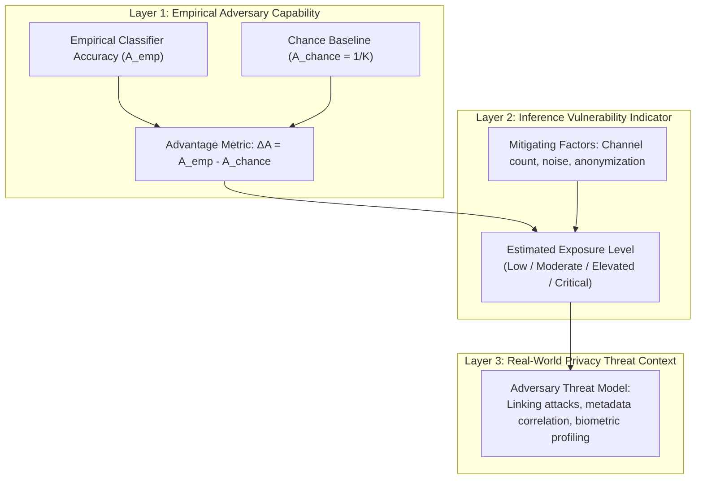

# NeuroAudit — Empirical Neural Privacy Interpretation Framework

**Document Version:** 1.0.0 (Phase 4)  
**Date:** August 2026  
**Status:** Conceptual Framework Specification  

---

## 1. Scope & Definitions

A central objective of NeuroAudit is to establish an academically rigorous link between **empirical machine learning classifier performance** and **neural privacy risk**.

> [!CAUTION]
> **Key Scientific Guardrail:**
> Empirical machine learning accuracy is **NOT** a direct probability of privacy loss.
> A subject classification accuracy of $65\%$ under laboratory conditions does **not** mean an individual has a $65\%$ probability of identity theft. It indicates that the mathematical feature representations extracted from the EEG signal retain sufficient idiosyncratic mutual information to allow statistical separation above chance.

---

## 2. Privacy Inference Spectrum

We define the privacy inference evaluation framework across three distinct layers:

---

## 3. Mathematical Interpretation of Adversary Advantage

Let $K$ be the number of candidate subjects in the pool.
* **Chance Performance Baseline:**
  $$A_{\text{chance}} = \frac{1}{K}$$
* **Empirical Adversary Decoding Rate:**
  $$A_{\text{empirical}} = \text{Balanced Accuracy of Adversary Model}$$
* **Normalized Inference Advantage ($\gamma$):**
  $$\gamma = \frac{A_{\text{empirical}} - A_{\text{chance}}}{1.0 - A_{\text{chance}}}$$
  where $\gamma \in [0.0, 1.0]$ describes the fraction of theoretical maximum re-identification capability achieved by the adversary.

### Interpretive Guidelines:
1. **$\gamma \approx 0.0$ (At Chance):** Minimal evidence of subject-level feature linkability under the tested feature representation.
2. **$0.0 < \gamma \le 0.25$ (Weak Separability):** Marginal statistical distinctiveness; low practical re-identification risk without significant auxiliary linking metadata.
3. **$0.25 < \gamma \le 0.60$ (Moderate Separability):** Evident structural distinctiveness; signal contains persistent biometric indicators across sessions.
4. **$\gamma > 0.60$ (Strong Separability):** High biometric fingerprintability; signal retains high individual specificity sufficient for robust automated re-identification.

---

## 4. Threat Model Contextualization

The practical realization of privacy risk depends on the adversary's access vector and auxiliary information:

| Threat Scenario | Adversary Access Vector | Auxiliary Knowledge | Role of Empirical Inference Metric |
|---|---|---|---|
| **Scenario 1: Cross-Database Linkage** | Anonymized EEG research recording | Auxiliary identified EEG database with overlapping subjects | $\gamma$ quantifies the feasibility of re-associating anonymous neural data with real identity records. |
| **Scenario 2: Longitudinal Profiling** | Multiple unnamed recording sessions | Timestamp and session logs | Measures adversary's ability to cluster disparate sessions as belonging to the same individual. |
| **Scenario 3: Covert State Inference** | Continuous BCI telemetry stream | Cognitive task context | Quantifies leakage of unconsented affective, cognitive, or stress states from raw telemetry. |
