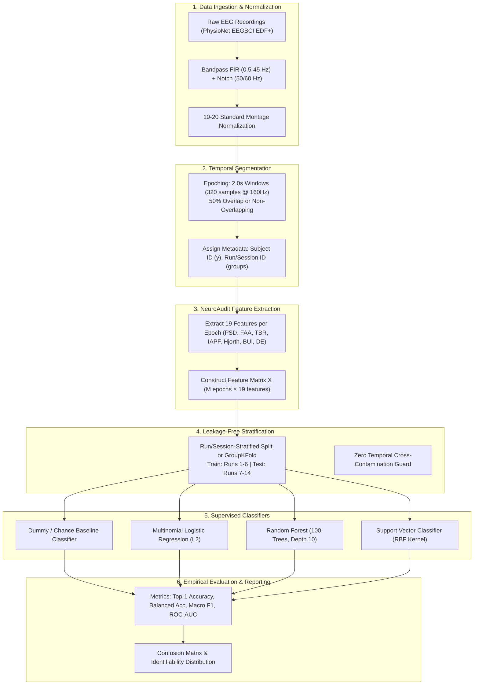

# NeuroAudit — Empirical Experiment Protocol: Subject Re-Identification

**Document Version:** 1.0.0 (Phase 4)  
**Date:** August 2026  
**Status:** Protocol Specification  
**Target Benchmark:** PhysioNet EEGBCI Dataset (Schalk et al., 2004)  
**Core Experiment:** Cross-Run Subject Re-Identification via Extracted EEG Features  

---

## 1. Experiment Overview & Pipeline

---

## 2. Leakage Prevention Strategy & Splitting Protocol

### 2.1 The Fatal Flaw of Random Train/Test Splitting in EEG
In EEG signal processing, applying standard random `train_test_split()` across continuous time epochs produces **severe, invalid optimistic bias**:
1. **Temporal Autocorrelation:** Adjacent epochs (e.g., $t \in [0, 2\text{s}]$ and $t \in [1, 3\text{s}]$) share identical background noise, electrode contact impedance, and slow baseline drifts.
2. **Session Memorization:** The model learns the transient recording setup rather than generalizable neural characteristics.

### 2.2 Leakage-Free Partitioning Protocol
To guarantee scientifically defensible results, NeuroAudit enforces **Session-Stratified Cross-Run Partitioning**:

* **Strategy A (Cross-Task / Cross-Run Split):**
  - **Training Set:** Baseline resting runs (Run 1: Eyes Open, Run 2: Eyes Closed) and initial motor runs (Runs 3–6).
  - **Testing Set:** Distinct subsequent motor execution and imagery runs (Runs 7–14).
  - **Guarantee:** No temporal overlap between training and testing data.

* **Strategy B (GroupKFold Cross-Validation):**
  - Grouping variable $g = \text{Run\_ID}$.
  - Whole runs are held out during each fold so that training and testing partitions never share continuous time sequences.

---

## 3. Machine Learning Classifiers

All models will be trained using standard `scikit-learn` estimators with deterministic random seeds (`random_state=42`):

1. **Dummy Baseline Classifier:** Stratified random and uniform chance baseline ($\text{Chance Accuracy} = 1 / N_{\text{subjects}}$).
2. **L2-Regularized Logistic Regression:** Scaled linear baseline with multinomial cross-entropy loss (`StandardScaler()` fitted strictly on training fold).
3. **Random Forest Classifier:** Non-linear ensemble model ($n_{\text{estimators}} = 100$, $\text{max\_depth} = 10$, Gini criterion).
4. **Support Vector Machine (SVC):** Kernelized margin classifier with RBF kernel and probability calibration via Platt scaling.

---

## 4. Empirical Evaluation Metrics

For a multi-class subject identification problem with $K$ subjects ($K \in [10, 109]$):

| Metric | Mathematical Definition | Purpose |
|---|---|---|
| **Top-1 Accuracy** | $\frac{1}{M} \sum_{i=1}^M \mathbb{I}(\hat{y}_i = y_i)$ | Primary identification rate across epochs. |
| **Balanced Accuracy** | $\frac{1}{K} \sum_{k=1}^K \frac{\text{TP}_k}{\text{TP}_k + \text{FN}_k}$ | Accounts for class imbalance across subject epoch counts. |
| **Macro-Averaged Precision** | $\frac{1}{K} \sum_{k=1}^K \text{Precision}_k$ | Evaluates positive predictive value across all subjects equally. |
| **Macro-Averaged Recall** | $\frac{1}{K} \sum_{k=1}^K \text{Recall}_k$ | Evaluates sensitivity to individual subject re-identification. |
| **Macro-Averaged F1-Score** | $\frac{2 \cdot \text{Precision}_{\text{macro}} \cdot \text{Recall}_{\text{macro}}}{\text{Precision}_{\text{macro}} + \text{Recall}_{\text{macro}}}$ | Harmonic mean balancing false positives and false negatives. |
| **Multi-Class ROC-AUC (OVR)** | Area under One-vs-Rest receiver operating characteristic | Measures ranking confidence across decision thresholds. |
| **Confusion Matrix** | $C \in \mathbb{R}^{K \times K}$ where $C_{ij}$ is count of true class $i$ predicted as $j$ | Identifies pairs of subjects with high mutual confusion. |

---

## 5. Execution Environment & Dependencies

* Python 3.11
* `scikit-learn >= 1.4.0`
* `mne >= 1.6.0`
* `numpy >= 1.26.0`
* `scipy >= 1.12.0`
