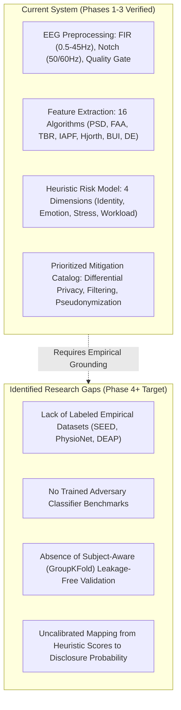

# NeuroAudit — Research Gap & Empirical Validation Roadmap

**Document Version:** 1.0.0 (Phase 3)  
**Date:** August 2026  
**Status:** Research Assessment Document  

---

## 1. Executive Summary

NeuroAudit currently implements a transparent, deterministic **Baseline Heuristic Privacy Risk Model** grounded in published neurophysiological literature. 

While the signal processing, feature extraction, and defensive data pipelines are verified and stable, the system has not yet been benchmarked against **ground-truth empirical datasets with trained machine learning classifiers**. 

This document defines the research gap between the current heuristic baseline and an empirically validated neural privacy auditing system.

---

## 2. Current System Status vs. Research Gaps

---

## 3. Detailed Research Gap Breakdown

### Gap 1: Labeled Benchmark Datasets
* **Current Baseline:** Operates on synthetic signal profiles and user-supplied unlabelled `.edf` recordings.
* **Research Requirement:** Benchmarking against standardized, peer-reviewed public EEG datasets containing verified ground truth for:
  - **Identity / Biometric:** PhysioNet EEG Motor Movement/Imagery Dataset (109 subjects across resting and motor tasks).
  - **Affective State / Emotion:** SEED (SJTU Emotion EEG Dataset) or DEAP dataset.
  - **Cognitive Workload / Stress:** STEW (Simultaneous Task EEG Workload) or PhysioNet Driving Stress EEG.

### Gap 2: Empirical Adversary Inference Models
* **Current Baseline:** Scores are computed using linear heuristic formulas and domain-informed threshold constants.
* **Research Requirement:** Training standard, interpretable machine learning classifiers (Logistic Regression, Random Forest, Support Vector Machines) to quantify empirical adversary decoding accuracy ($\text{Accuracy}$, $\text{Balanced Accuracy}$, $\text{AUC-ROC}$, $\text{F1-Score}$).

### Gap 3: Subject-Aware Evaluation & Zero Subject Leakage
* **Current Baseline:** Features are extracted independently per recording.
* **Research Requirement:** In multi-subject datasets, random train/test splitting causes severe **subject leakage** (the classifier learns the subject's idiosyncratic biometric signature rather than the target affective/cognitive state). All future empirical evaluations must enforce strict **GroupKFold / Leave-One-Subject-Out (LOSO)** cross-validation.

### Gap 4: Empirical Risk Calibration Layer
* **Current Baseline:** Composite overall risk score is calculated via fixed heuristic weighting:
  $$\text{Overall Risk} = 0.30 \times \text{Identity} + 0.25 \times \text{Emotion} + 0.25 \times \text{Stress} + 0.20 \times \text{Workload}$$
* **Research Requirement:** Developing a calibrated mathematical transfer function $f(\text{Accuracy}_{\text{empirical}}) \to \text{Risk Score}$ that maps actual adversary decoding capability above chance level to a 0–100 privacy exposure index.

---

## 4. Empirical Validation Roadmap & Current Status

| Phase | Milestone | Status | Deliverables |
|---|---|:---:|---|
| **Phase 1** | **Stabilization & Hardening** | **COMPLETE** | Defensive signal filtering, upload validation, robust error handling. |
| **Phase 2** | **EEG Feature Validation** | **COMPLETE** | Numerical stability, test suite (`test_features.py`), algorithmic definitions. |
| **Phase 3** | **Baseline Methodology** | **COMPLETE** | Mathematical traceability, contributor breakdowns, score bounds (`test_scoring.py`). |
| **Phase 4** | **Dataset & Protocol Preparation** | **COMPLETE** | PhysioNet EEGBCI selection (`DATASET_SELECTION.md`), protocol (`EXPERIMENT_PROTOCOL.md`), schema (`ML_FEATURE_SCHEMA.md`), ML scaffold (`backend/ml/`). |
| **Phase 5** | **Interpretable ML Classifiers** | *Future* | Logistic Regression, Random Forest, SVM training pipelines with GroupKFold cross-validation. |
| **Phase 6** | **Empirical Risk Calibration Layer** | *Future* | Calibration curves, dual-layer scoring (Heuristic + Empirical ML). |
| **Phase 7** | **Defense Simulation & Utility Validation** | *Future* | Mitigation simulations, Privacy vs. Utility (SNR/ERP) tradeoff metrics. |

---

## 5. Explicit Distinction: Current vs. Future State

* **CURRENT (Phases 1–4):**
  - Verified signal-processing and feature extraction pipeline producing 19 deterministic features.
  - Transparent heuristic baseline scoring with fully attributable feature contributions.
  - Formally specified experiment protocol, leakage-free cross-validation plan, feature schema, and dataset selection.
  - **No empirical training or model classification results exist yet.**

* **FUTURE (Phase 5+):**
  - Download of modular PhysioNet EEGBCI subject data.
  - Training of supervised scikit-learn classifiers on extracted 19-feature vectors.
  - Execution of GroupKFold cross-run re-identification evaluation.
  - Empirical measurement of adversary advantage ($\gamma$) and calibration curve fitting.

